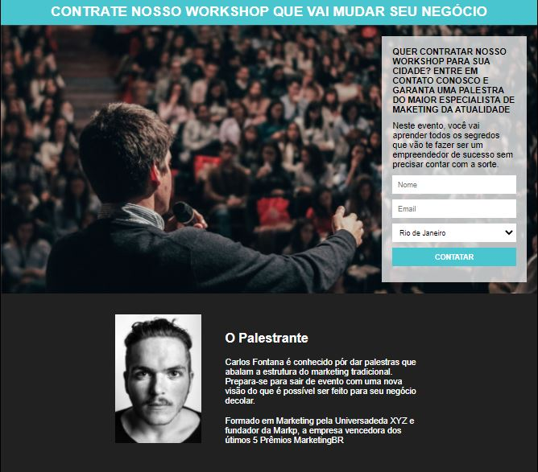

<h1 align="center">
   Workshop
</h1>

<h1>
    
</h1>

<h3 align="center">
    <a href=""
    >Acessar a demonstração</a>
<h3 >

# Indice

- [Sobre](#-sobre)
- [Tecnologias Utilizadas](#-tecnologias-utilizadas)
- [Como baixar o projeto](#-como-baixar-o-projeto)

## 🔖&nbsp; Sobre

O projeto **Workshop** é um e-commerce que foi criado como desafio no **Hiring coders** com o intuito de colocarmos em prática o conteúdo estudado durante a primeira etapa.

---

## 🚀 Tecnologias utilizadas

O projeto foi desenvolvido utilizando as seguintes tecnologias

- [Html]
- [CSS]
- [JavaScript]

---

## 🗂 Como baixar o projeto

```bash

    # Clonar o repositório
    $ git clone

    # Entrar no diretório
    $ Abrir index
```

---

Desenvolvido por Heyverson Arley
